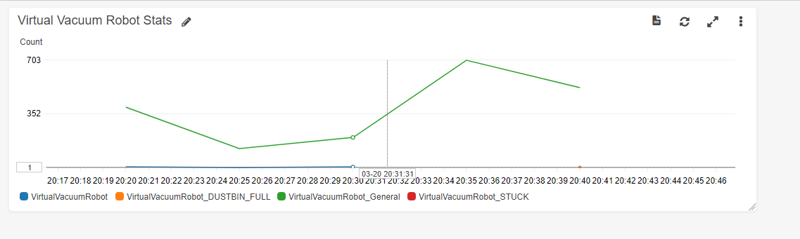

# AmazonSNS-Docker-Challenge

In this challenge, we'll be exploring Amazon SNS for publishing and handling events.

## Helpful Links

[.NET AWS SDK Docs](https://docs.aws.amazon.com/sdkfornet/v3/apidocs)

## Pre-requisites

The following tools and accounts are required to complete these instructions.

- [AWS Account](https://aws.amazon.com/)
- [Install AWS CLI](https://aws.amazon.com/cli/)
- [Install .NET Core 2.2](https://www.microsoft.com/net/download)
- [Docker](https://www.docker.com/get-started)

## Level 0

Start the docker containers locally. Follow the getting started guide here: https://github.com/skittleson/VirtualVacuumRobot#getting-started

Once the containers are ready, events like this will appear.

```bash
vvr_1  | {"id":5548,"message":"85","eventType":"READY","timestamp":"2019-03-20T17:58:36.0328565Z"}
vvr_2  | {"id":7766,"message":"88","eventType":"READY","timestamp":"2019-03-20T17:58:39.9083326Z"}
vvr_3  | {"id":412,"message":"83","eventType":"READY","timestamp":"2019-03-20T17:58:43.6412794Z"}
```

<details><summary>Not hard enough for you?</summary>
Great! Can you do this in Fargate? Or EKS?
</details>

## Level 1

Publish a SNS topic message to have the vacuums to clean. The sns topic is `VirtualVacuumRobot`. Go the [AWS console Simple Notification Services](https://us-east-1.console.aws.amazon.com/sns/v3/home?region=us-east-1#/topics). `{'action':'start'}`.

<details><summary>Not hard enough for you?</summary>
Great! Can you send each vacuum to charge when it reaches 20% power?
</details>

## Level 2

After a **couple cleanings**, the dustbin gets full! Human intervention is needed. Subscribe to the SNS topic: `VirtualVacuumRobot_DUSTBIN_FULL` for a SMS message. Then you will want to reset the dustbin using the command: `{'action':'dustbin'}`

Hint: You will need to clean **at least twice** for this event to appear.

<details><summary>Not hard enough for you?</summary>
Great! Can you listen for the sns topic `VirtualVacuumRobot_DUSTBIN_FULL` in a lambda function and clear the dustbin via a sns message?
</details>

## Level 3

You're getting the hang of it! Although, manually sending topic messages works, it would be much nice to schedule a cleaning job to start the vacuums. For level 3 go ahead and create a lambda function to kickoff a new cleaning job every 5 minutes. Remember the sns topic is `VirtualVacuumRobot`.

You can use [LambdaSharpTool](https://github.com/LambdaSharp/LambdaSharpTool), [Serverless](https://serverless.com/), or create a lambda function manually.

Hint 1: https://docs.aws.amazon.com/sdk-for-javascript/v2/developer-guide/sns-examples-publishing-messages.html

Hint 2: https://docs.aws.amazon.com/lambda/latest/dg/tutorial-scheduled-events-schedule-expressions.html

<details><summary>Not hard enough for you?</summary>
Great! Make each vacuum clean **one at a time** but never the same vacuum twice in a row.
</details>

## Level 4

All these messages are starting to get a bit overwhelming - let's add this data to a CloudWatch dashboard to draw insights from the virtual vacuum data. Each published sns metric is a sum statistic every 30 seconds with a total period of 30 minutes. See example below.



## Boss

</a></p>

Vacuums rarely get stuck (1 out 1000 chances). When they do, can you please send yourself a SMS then shutdown the vacuum with: `{'action':'shutdown'}`

<details><summary>Not hard enough for you?</summary>
Great! The messages are in json format... can you make it more human readable?
</details>

## Clean up

Publish a SNS message to clean up: `{'action': 'teardown'}`
